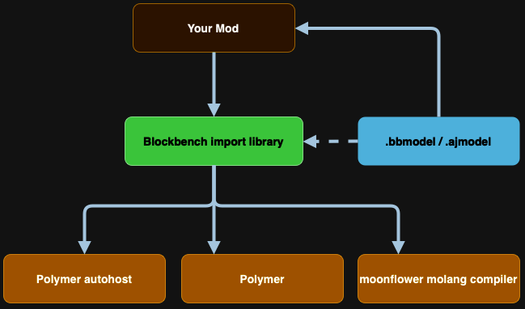

# blockbench import library

Library to make importing Blockbench models easy, automatically creates item models and textures and hosts them via polymer autohost

## Setup


```
repositories {
    maven { url "https://maven.tomalbrc.de" }
}

dependencies {
    modImplementation include("de.tomalbrc:blockbench-import-library:[TAG]")
}
```

## Main Features

- Import Generic Blockbench (bbmodel) or AnimatedJava (ajmodel) files with animations
- Resourcepack generation (Item model and texture)
- Supports Molang expressions for animations in keyframes, queries supported at the moment: `q.anim_time` and `q.life_time`
- Items with CustomModelData are used to display the bones using Item Displays
- "Virtual" Item Display entities - low performance impact on the server as only packets are sent to the clients
- Async updates of Item Display transformations
- Supports bones larger than javas' 3x3x3 item model size restrictions

#
#### Support for various Blockbench features:
- Effect keyframes: Commands can be run and sounds be played using effects
- Animation loop modes, interpolations, start and loop delays, etc.

#
#### Extensions for AnimatedJava:
- Variants: Ability to instantly switch between different models and textures.
- Bone blacklists
- Effect keyframes: Additionally supports variant effects, additionally, effects can be played conditionally
- Locators: Can be used to listen for pose updates on a specific part of the model. These listeners
  can be used to add extra animated objects to the model, such as particles and other entities.

#
#### Out of the box support for many vanilla mob features:
- Vanilla accurate hitboxes visible in F3+B, using interactions.
- The ability to ride on top of the mob, without visually lagging behind.
- Name tags that work just like vanilla mobs, without text display entities.
- Working invisibility, glowing, fire animation and most particles (like potion effects, crits and death).
- Correctly rendering leashes, death animations and smooth clientside collisions with players.
- Dynamic hitboxes and dynamic mob scale (an example use case of this is baby mobs).
- The model won't tick if the entity wasn't ticked, reducing server and network load.
- Uses the display entities culling boxes to reduce client lag.

## Commands

- `/bil model create id<.ajmodel>|filepath <model>`
  > Spawns a model ingame based on mob identifier or a file path (from server root folder) to the model json file. These models are not saved and are mostly intended for testing. If you want load an .ajmodel file, make sure to append `.ajmodel` to either the id or file path.
  
- `/bil model <targets> animation|variant|scale <args>`
  > Modifies the model of any entity selected in <targets> that has a custom model. Allows you to temporarily change the scale of the model, update the variant and play / pause / stop animations. This is also mostly intended for testing and playing with the models.

## Usage

Models can be loaded using `BbModelLoader` or `AjModelLoader` classes, they provide static `load` methods for resources and files.

It is recommended to store the resulting `Model` in memory, as loading a bbmodel may take some time!

#### [You can find the documentation here](https://tomalbrc.de/projects/bil/docs)



## Roadmap

### 1.x

- Bone modifier for more dynamic animations
- Handle pre/post values for keyframes
- mcmeta generation for animated textures
- Bezier support for keyframes

### 2.x

- Dynamic Animations for dynamic animation speed, right now all animations are pre-rendered during import
- Per-player animations; Show animations to only a single player or a group of players. Right now all animations are played globally, visible for all players
- Multiple rider (for entities), currently only 1 is supported
- Multiple hitboxes (requires the same changes as multiple rider support)
- Particle effects (?)
  
---

This project is the continuation of my old project nylon and uses code from the animation engine: [nylon - library for the animated java 0.4 json exporter](https://github.com/Provim-Gaming/nylon)

You can find the original license in LICENSE.nylon
